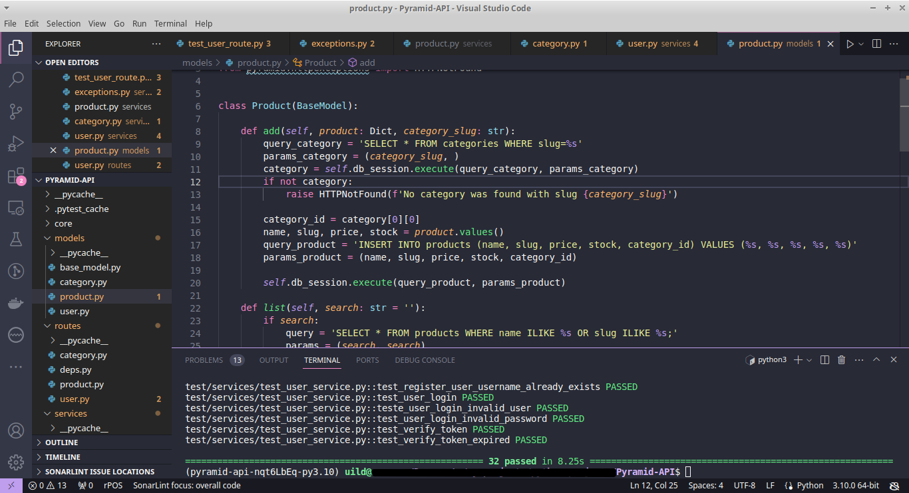

#Multilingual Content (Portuguese, English)

API Pyramid com Banco de Dados (Sem ORM) e Testes com Pytest

Este é um exemplo de construção de uma API RESTful utilizando o framework Pyramid com o banco de dados Postgres.  
O projeto demonstra como configurar rotas, lidar com requisições e interagir com um banco de dados usando SQL puro, além de incluir testes automatizados usando o Pytest.

English

This is an example of building a RESTful API using the Pyramid framework with the Postgres database.  
The project demonstrates how to set up routes, handle requests, and interact with a database using raw SQL, along with including automated tests using Pytest.

